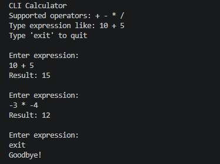

# CLI Calculator

A simple CLI-based calculator that demonstrates FP concepts and provides exposure to simple scala syntax before jumping to [Task Manager](../02-task-manager/README.md) for more advanced concepts.

## Overview

This project parses and evaluates user input from CLI for simple arithmetic expressions by validating input, performing operation, and output result while handling errors in a functional and type-safe way.

Basic automated tests were also added to verify service and repository behavior.

## Features

- Reads arithmetic expressions from CLI (e.g., `10 + 5`, `-3 * -4`)
- Supports operators: `+`, `-`, `*`, `/`
- Handles negative numbers (e.g., `-3 * -4`, `3 * -5`)
- Ignores extra whitespace in input
- Validates expression structure and numbers
- Handles errors using typed domain models
- Includes simple automated tests using ZIO Test

## Architecture

- **Main** → Entry point and orchestration
- **CalculatorService** → Parsing and calculation logic
- **CalculatorRepository** → Provides supported operators
- **PrintService** → Handles CLI output (not required but kept it to showcase multiple services)
- **CalculatorError** → Typed domain error modeling
- **BinaryOperation** → Domain model representing a single calculation
- **Tests** → Basic service and repository specs using ZIO Test


## What I learned

- Scala syntax
- Pure vs non-pure functions
- `ZIO[R, E, A]` effect model
- Functional composition using `for`
- yped error handling and Service abstraction using `trait`
- Dependency injection using `ZLayer`

## Supported Input

Valid examples:

```text
10 + 5
10+5
-3 * 4
3 * -5
-3 * -4
2.5 + 1.2
````

## Invalid Input Examples

```text
10 +
* 5
10 ++ 5
10 + 5 - 2
(10 + 5)
```

These will result in appropriate error messages.

## Example Flow

1. User enters an expression
2. Input is validated:

   * Empty input → error
   * Invalid expression → error
   * Invalid number → error
   * Invalid operator → error
3. Expression is parsed into a `BinaryOperation`
4. Calculation is performed
5. Result is printed

## Running the Project

```bash
sbt run
```

## Running Tests

```bash
sbt test
```

## Sample Output



## Design Decisions

* Supports only **single binary expressions** (`a op b`)
* Does **not support chained operations or parentheses** to keep the project intentionally simple
* Unary minus (`-`) is supported for negative numbers
* Operator parsing is handled manually instead of using regex-heavy or parser-library-based solutions (I couldn't find a proper regex for my situation, may change in future).
* Test coverage focuses on service and repository behavior rather than CLI console interaction

