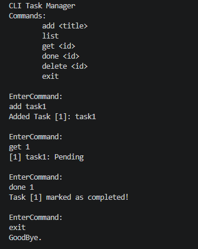

# CLI Task Manager (ZIO + Ref)

A simple CLI-based task manager built using **Scala 3** and **ZIO** to demonstrate functional backend concepts like **state management with Ref**, **typed errors**, and **layered architecture**.

## Features

- Add task → `add <title>`
- List tasks → `list`
- Get task → `get <id>`
- Complete task → `done <id>`
- Delete task → `delete <id>`
- Exit → `exit`


## Example




## Project Structure

```text
src/main/scala/clitaskmanager/
├── Main.scala
├── domain/
├── repository/
└── service/
````


## Architecture

* **Main** → CLI handling
* **Service** → business logic
* **Repository** → state access
* **Ref** → in-memory storage


## Key Concepts

* `Ref` for safe mutable state
* Typed errors using sealed traits
* Separation of service and repository
* Dependency injection using `ZLayer`


## Running

```bash
sbt run
```

## Notes

* Uses in-memory storage (no database)
* Supports only basic commands
* Designed for learning backend structure with ZIO


## Tech Stack

* Scala 3
* ZIO
* sbt

